# 第 1 章: dbt の基礎と開発環境セットアップ

## 講義 1: dbt とモダンデータスタックの概要

### 入門: データパイプライン

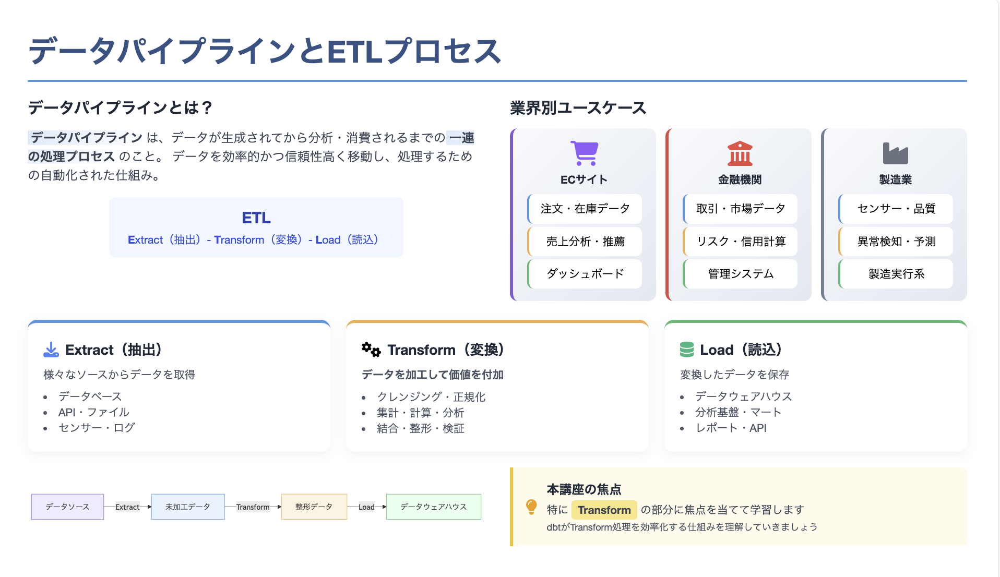

### 入門: データパイプラインにおける transform の重要性

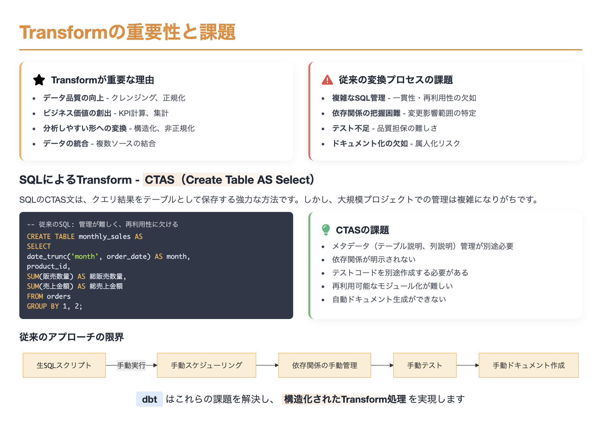

### 入門: なぜ dbt なのか？

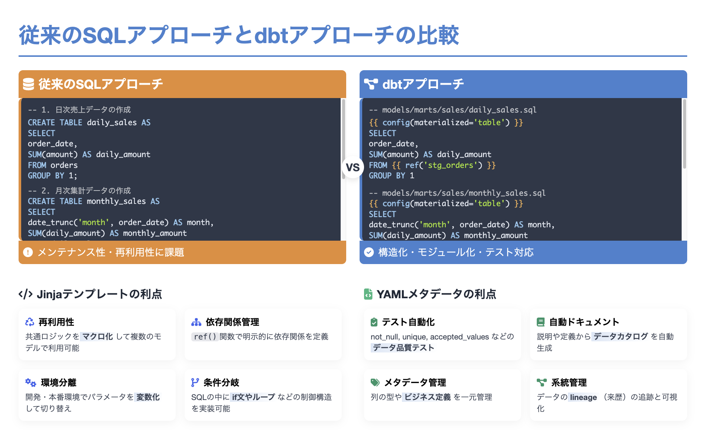

### 入門: dbt が注目される理由

- **ソフトウェア開発のプラクティスをデータ分析に導入**

  - バージョン管理（Git）との統合
  - モジュール化されたコード
  - テスト駆動開発
  - CI/CD（継続的インテグレーション/デリバリー）

- **dbt の主な利点**
  - 依存関係の自動管理（DAG）
  - データ品質テスト
  - 自動ドキュメント生成
  - コード再利用（マクロ）
  - バージョン管理との統合

### 入門: dbt のメンタルモデル

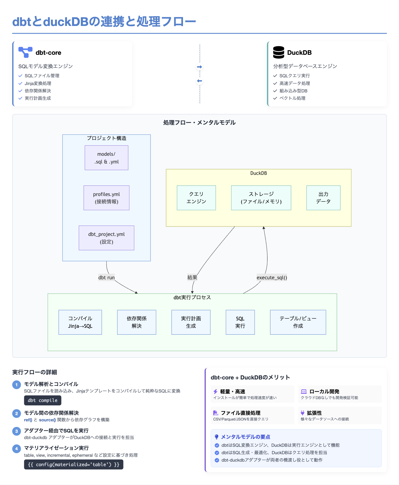

## 講義 2: 開発環境の準備（MacOS, Python, dbt Core インストール）

### 前提条件

- MacOS
- Python 3.10

### Python 環境の確認

ターミナルで以下のコマンドを実行して、Python のバージョンを確認します：

```bash
python --version
```

### 仮想環境の作成と有効化

```bash
# 仮想環境の作成
python -m venv .venv

# 仮想環境の有効化
source .venv/bin/activate

# pip（パッケージマネージャー）のアップグレード
pip install --upgrade pip
```

### インタープリタの指定

`.venv/bin/python` を右クリックして、「相対パスをコピー」をクリックしてクリップボードに `.venv/bin/python` のパスをコピーします。

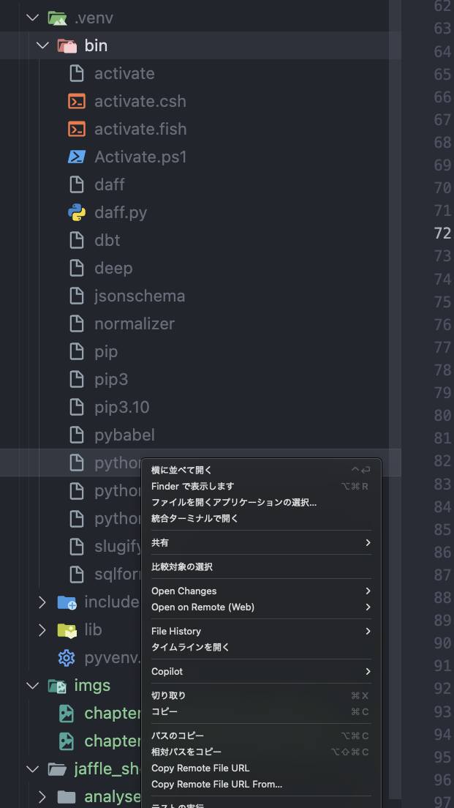

Cmd+Shift+P を押して「Python: インタープリタを選択」を選択し、`.venv`を選択します。

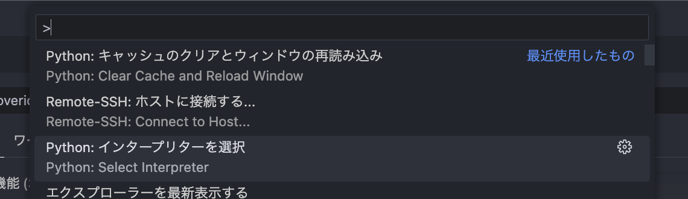

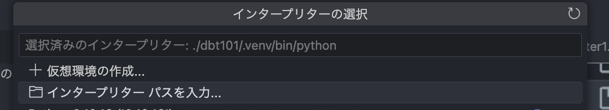

クリップボードにコピーしたパスを入力して enter を押します。

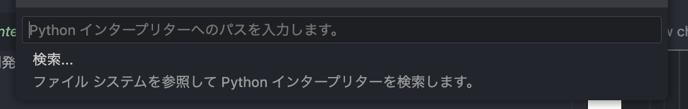

### dbt-core と DuckDB アダプタのインストール

```bash
# 依存パッケージのインストール
pip install -r requirements.txt
```

### インストールの確認

```bash
# dbtのバージョン確認
dbt --version
```

期待される出力例：

```
Core:
  - installed: 1.9.3
  - latest:    1.9.4 - Update available!

  Your version of dbt-core is out of date!
  You can find instructions for upgrading here:
  https://docs.getdbt.com/docs/installation

Plugins:
  - duckdb: 1.9.3 - Up to date!
```

これで dbt-core と DuckDB アダプタのインストールが完了しました。

> **コラム: DuckDB とは？dbt-core とは？**
>
> **DuckDB** は組み込み形式で動作するデータベース管理システムです。外部依存が一切なく、単一のヘッダー＋実装ファイル（amalgamation）として配布されるため、インストールもデプロイも非常にシンプルです。そのためローカル開発環境でのプロトタイピングや小規模データ処理に最適です。今回はこのデータベースの中で dbt を動かしてみましょう。
> 主な特徴として以下が挙げられます：
>
> - 高速なベクトル化エンジン による並列クエリ処理（大規模データセットでもメモリ超過せずに解析可能）。
> - CSV / Parquet / JSON ファイル を外部ストレージ（ローカルや S3）から直接読み書き可能。
> - 多言語 API（Python, R, Java, Node.js など）と統合しやすい設計。
>
> **dbt-core** は dbt によるデータ変換を実現するフレームワークで、プロジェクト構成や実行フロー、DAG 管理、Jinja テンプレートの解釈など、dbt の中核機能を提供します。dbt は様々なデータプラットフォーム向けにライブラリを公開しており、それらを使った **アダプタ** 方式で接続します。
>
> **dbt-duckdb アダプタ** を導入することで、dbt-core が DuckDB と対話し、SQL モデルを実行・テスト・ドキュメント化できるようになります。近年よく使われているデータウェアハウス（Snowflake, BigQuery, Redshift など）やデータベース（PostgreSQL, MySQL など）向けのアダプタも存在します。実際のプロジェクトでは、これらのアダプタを使ってデータウェアハウスに接続し、データ変換パイプラインを構築することになるでしょう。

## 講義 3: dbt プロジェクトの初期化とデータ準備

### dbt プロジェクトの作成

```bash
# 新しいdbtプロジェクトを作成
dbt init jaffle_shop
```

dbt-duckdb をインストールしているので、以下のようなプロンプトが表示されます：

```
Setting up your profile.
Which database would you like to use?
[1] duckdb

(Don't see the one you want? https://docs.getdbt.com/docs/available-adapters)

Enter a number: 1
```

### プロジェクト構造の確認

```bash
# プロジェクトディレクトリに移動
cd jaffle_shop

# ディレクトリ構造の確認
ls -la
```

主要なファイルとディレクトリ：

```
jaffle_shop/
├── dbt_project.yml    # プロジェクト設定ファイル
├── analyses/          # 分析用SQLを格納するディレクトリ
├── macros/            # マクロを格納するディレクトリ
├── models/            # SQLモデルを格納するディレクトリ
│   └── example/       # サンプルモデル
├── seeds/             # CSVデータを格納するディレクトリ
├── snapshots/         # スナップショットを格納するディレクトリ
├── tests/             # カスタムテストを格納するディレクトリ
```

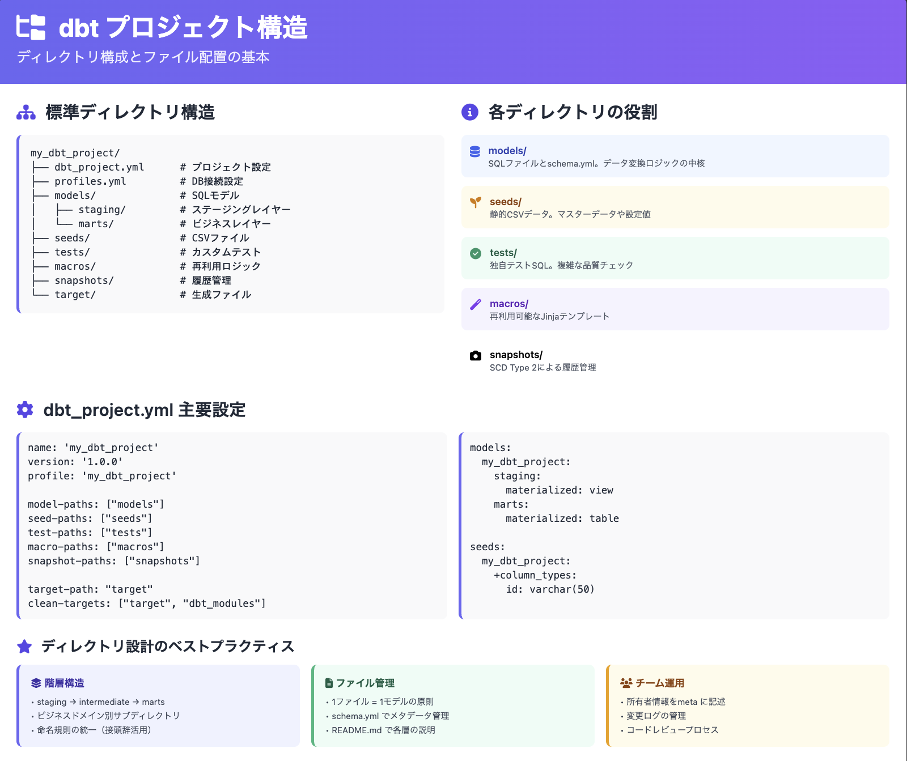

### VSCode の拡張機能のインストール

1. VSCode を開く
2. 拡張機能タブをクリック（または `Cmd+Shift+X`）
3. 以下の拡張機能を検索してインストール：
   - **dbt Power User** - dbt プロジェクトの開発支援

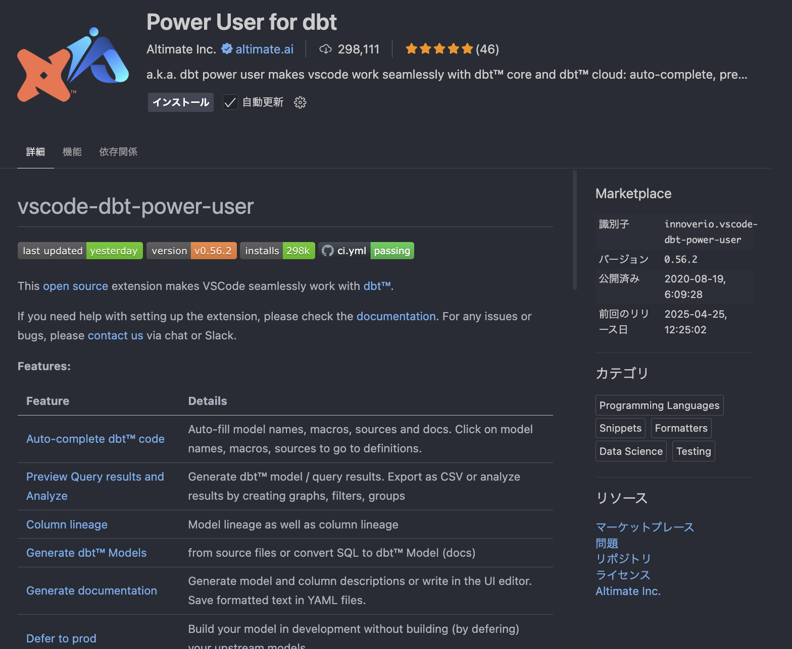

#### 拡張機能 "Power User for dbt" インストールの確認

エディタで `models/example/my_first_dbt_model.sql` を開いた状態で Cmd+J を押してターミナルを含む下パネルを表示します。その中に LINEAGE タブがあるのでクリックしてください。

図のように二つのノードと矢印が表示されている場合、拡張機能が正しくインストールされ現在の dbt プロジェクトが正しく認識されていると確認できます。

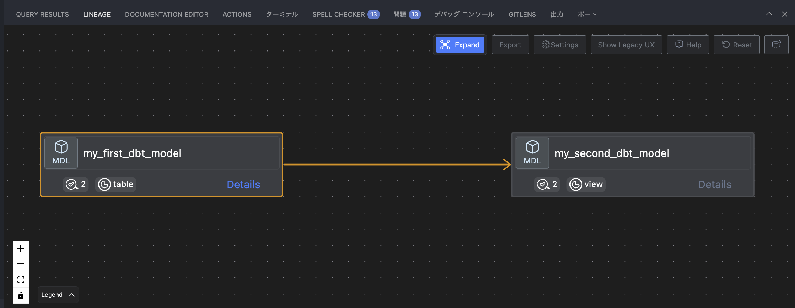

### プロジェクト設定ファイルの確認

`dbt_project.yml`の主要な設定：

```yaml
name: "jaffle_shop"
version: "1.0.0"

profile: "jaffle_shop"

model-paths: ["models"]
analysis-paths: ["analyses"]
test-paths: ["tests"]
seed-paths: ["seeds"]
macro-paths: ["macros"]
snapshot-paths: ["snapshots"]

clean-targets:
  - "target"
  - "dbt_packages"

models:
  jaffle_shop:
    example:
      +materialized: view
```

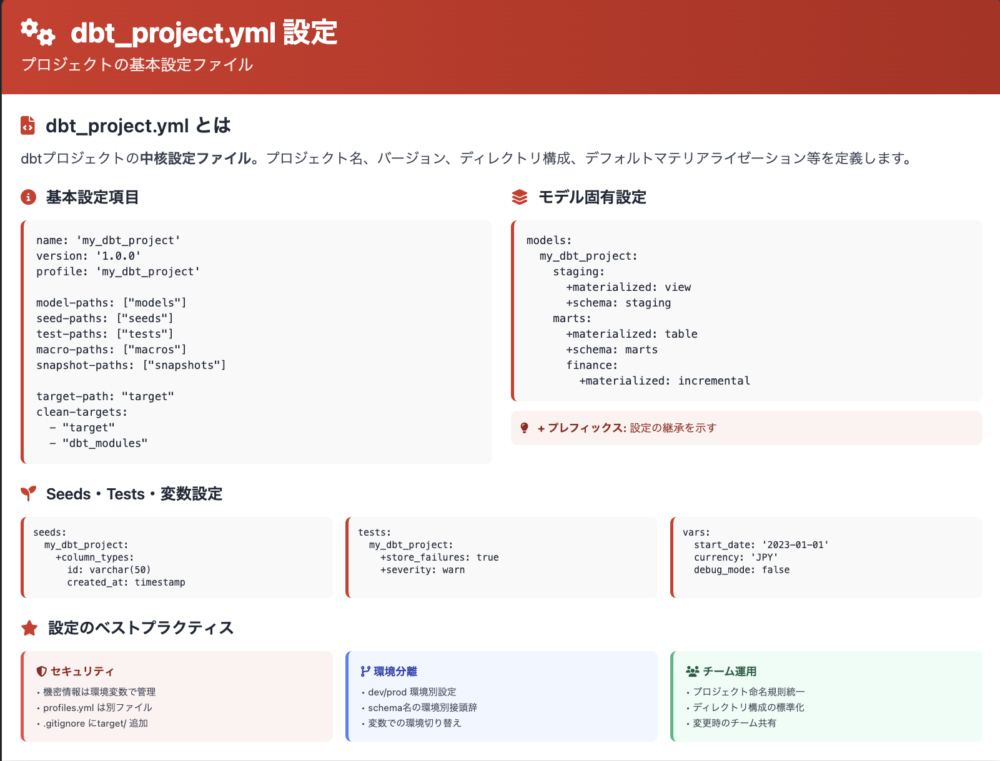

### DuckDB プロファイルの設定

デフォルトで作成されたプロファイル設定ファイルをプロジェクト内の profiles.yml ファイルにコピーします：

```bash
# jaffle_shop ディレクトリ内で実行 - ファイルをコピー
cp ~/.dbt/profiles.yml ./profiles.yml
```

> **注意**: デフォルトでは dbt は`~/.dbt/profiles.yml`を参照しますが、`--profiles-dir`オプションを使用することでプロジェクト内の profiles.yml を使用できます。

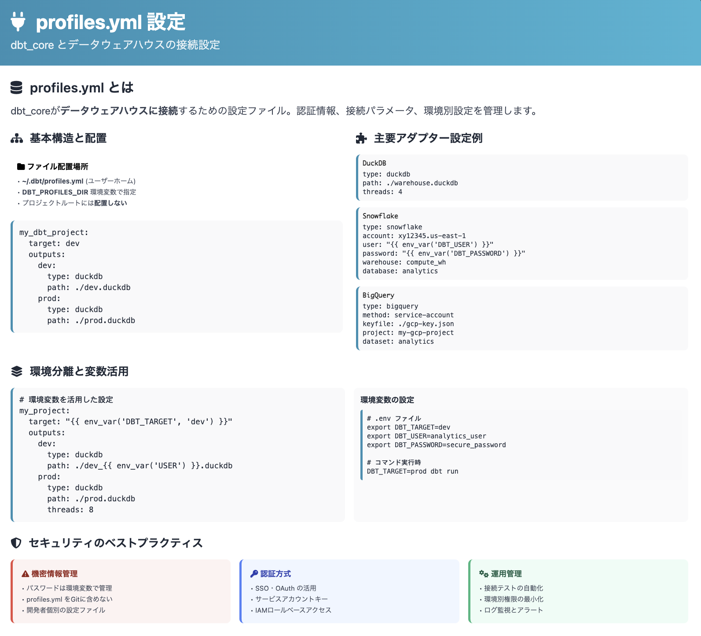

### サンプルデータの準備

1. `seeds`ディレクトリに CSV ファイルを作成

https://github.com/dbt-labs/jaffle-shop-data から CSV ファイルをダウンロードして、`seeds`ディレクトリに保存します。

### シードデータのロード

```bash
# プロジェクト内のprofiles.ymlを使用してシードデータをDuckDBにロード
dbt seed --profiles-dir .
```

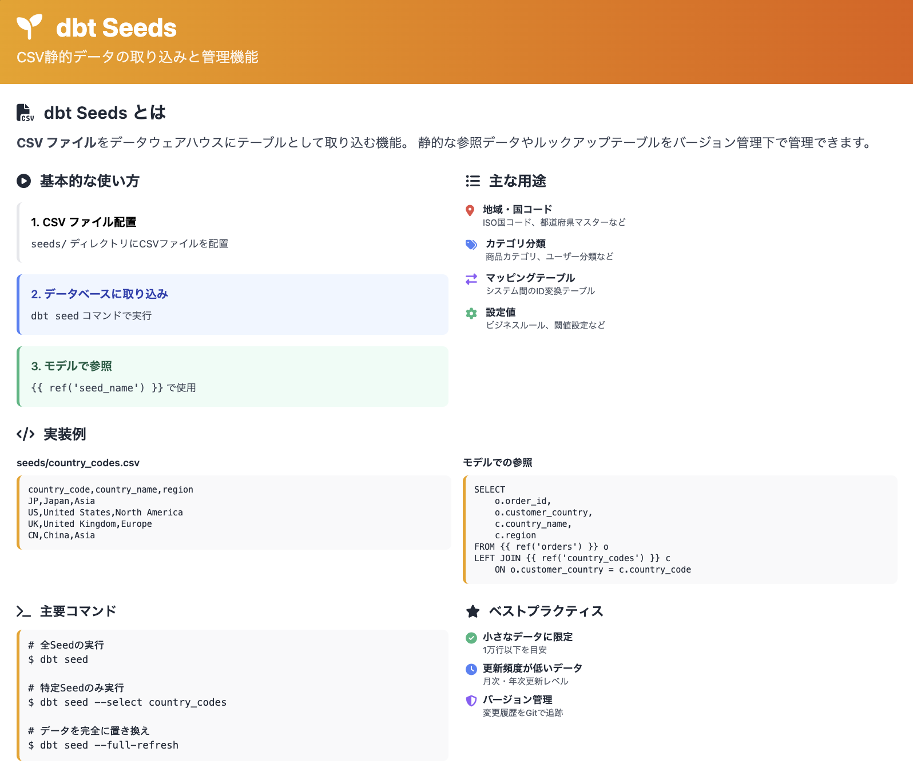

## 講義 4: 最初のモデル作成と実行

### モデルディレクトリの構成

```bash
# modelsディレクトリ内にstagingディレクトリを作成
mkdir -p models/staging
```

### 最初のモデル作成

`models/staging/stg_customers.sql`ファイルを作成：

```bash
cat > models/staging/stg_customers.sql << 'EOF'
-- models/staging/stg_customers.sql
-- 顧客データのステージングモデル

select
    id as customer_id,
    name as customer_name
from {{ ref('raw_customers') }}
EOF
```

### モデルの実行

```bash
# プロジェクト内のprofiles.ymlを使用してモデルを実行
dbt run --profiles-dir .
```

### 依存関係グラフ（DAG）の確認

dbt は自動的に依存関係を解析し、以下のような実行順序を決定します：

```
customers (seed) → stg_customers (model)
```

### Jinja 構文と`ref`関数

- `{{ ref('raw_customers') }}`は、シードデータ「customers」を参照するための構文
- `ref`関数を使うことで、dbt は依存関係を自動的に解析し、実行順序を決定
- モデル間の参照も同様に`ref`関数を使用（例：`{{ ref('stg_customers') }}`）

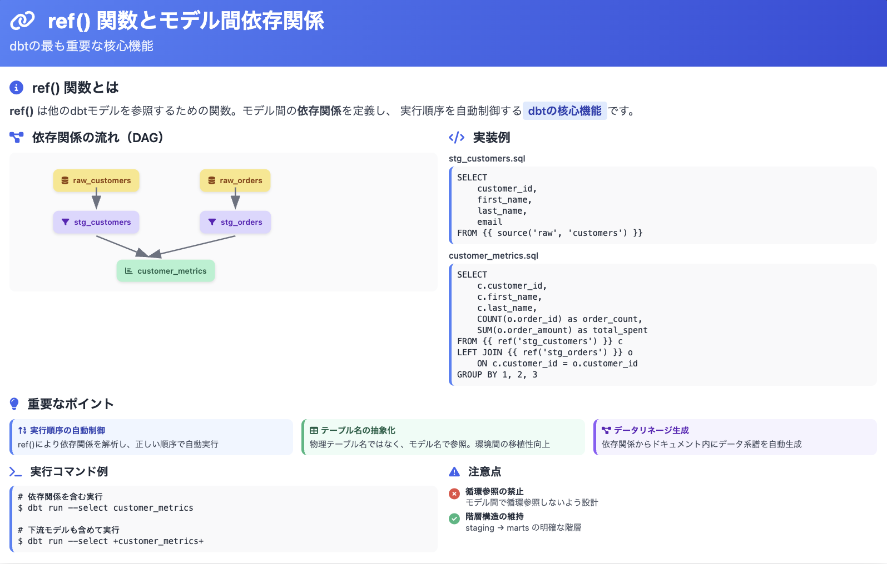

### モデルの確認

DuckDB でモデルの内容を確認：

```bash
curl https://install.duckdb.org | sh
```

```bash
# DuckDBを起動
duckdb dev.duckdb

SELECT * FROM raw_customers;

SELECT * FROM stg_customers;
```

Ctrl + D で DuckDB を終了します。

`duckdb dev.duckdb -c <SQLクエリ>` で直接クエリを実行することもできます。

```bash
duckdb dev.duckdb -c "SELECT * FROM stg_customers;"
```

### まとめ

この章では以下の内容を学びました：

1. dbt とモダンデータスタックの概要
2. 開発環境のセットアップ（Python、dbt Core、DuckDB）
3. dbt プロジェクトの初期化とサンプルデータの準備
4. 最初のモデル作成と実行

次の章では、より複雑なモデル開発と品質管理について学びます。
