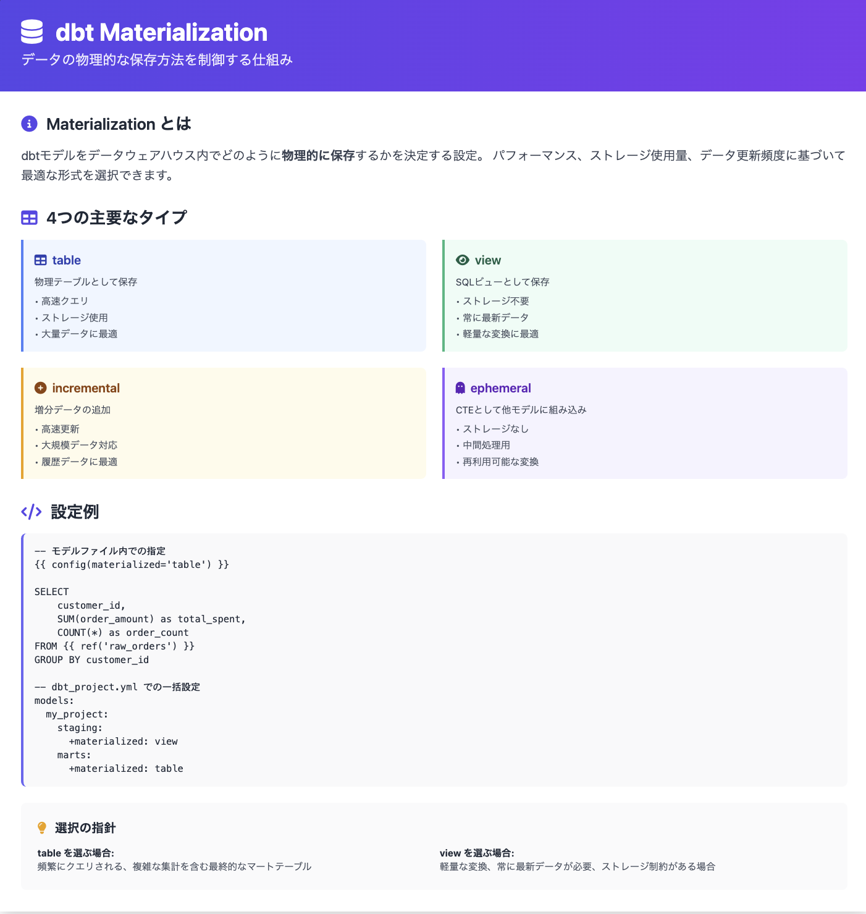
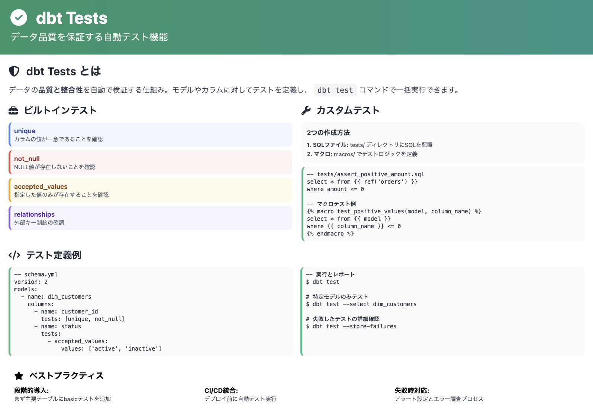
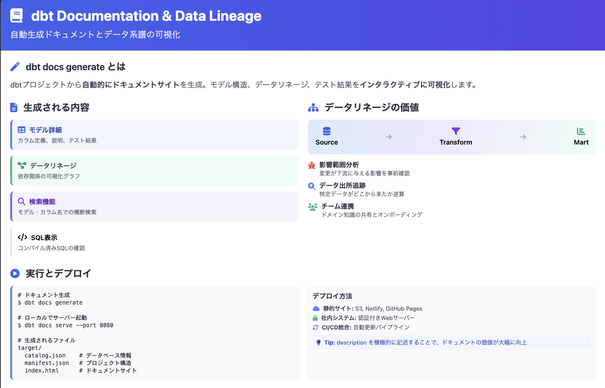
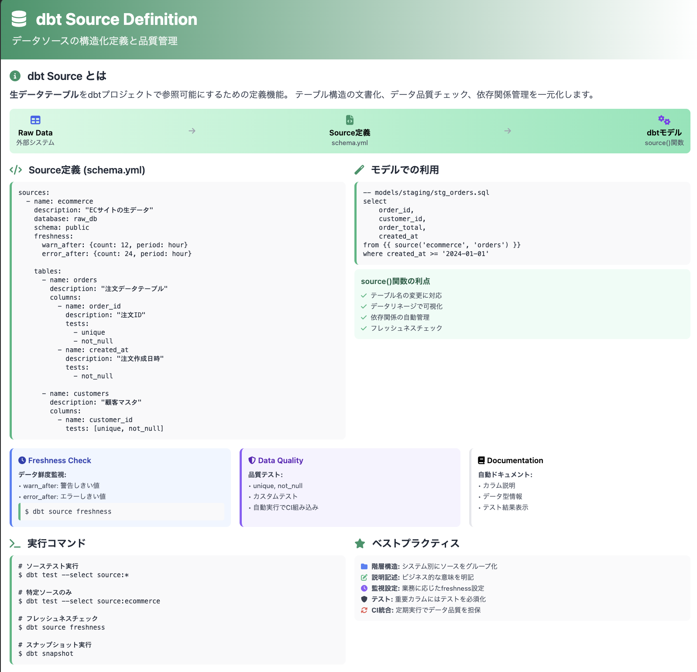
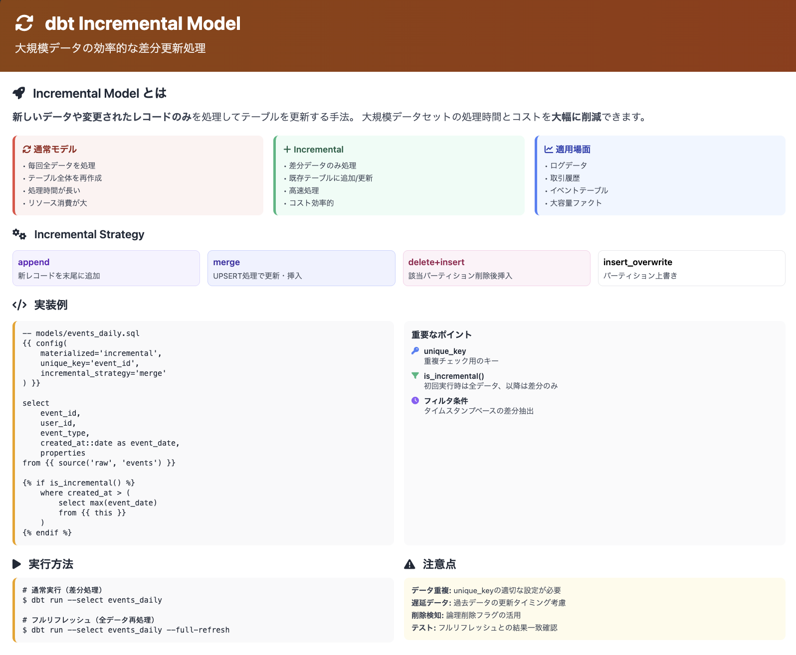

# 第 2 章: モデル開発の実践と品質管理

## 講義 1: モデルの拡張とデータ変換ロジック

### モデル階層の設計

dbt プロジェクトでは、モデルを論理的な階層に分けることが一般的です：

```
models/
├── staging/      # 生データの整形（一対一の変換）
├── intermediate/ # 中間テーブル（オプション）
└── marts/        # 分析用の集計テーブル
    ├── core/     # 主要ビジネスプロセス
    └── marketing/ # 部門別モデル
```

---

---

### ステージングモデルの作成

前章で作成した`stg_customers.sql`に加えて、注文と支払いのステージングモデルを作成します。

1. `models/staging/stg_orders.sql`の作成：

```bash
cat > models/staging/stg_orders.sql << 'EOF'
-- models/staging/stg_orders.sql
-- 注文データのステージングモデル

select
    id as order_id,
    customer as customer_id,
    ordered_at,
    store_id,
    subtotal / 100.0 as subtotal_dollars,
    tax_paid / 100.0 as tax_paid_dollars,
    order_total / 100.0 as order_total_dollars
from {{ ref('raw_orders') }}
EOF
```

2. `models/staging/stg_items.sql`の作成：

```bash
cat > models/staging/stg_items.sql << 'EOF'
-- models/staging/stg_items.sql
-- 注文アイテムデータのステージングモデル

select
    id as item_id,
    order_id,
    sku as product_sku
from {{ ref('raw_items') }}
EOF
```

### ファクトテーブルの作成

> **📊 ファクトテーブルとは**
>
> **一般論：**
> ファクトテーブルは、ビジネスプロセスで発生するトランザクションやイベントを記録するテーブルです。主に数値データ（メトリクス）を含み、各レコードが特定の時点でのビジネスイベント（販売、注文、支払いなど）を表します。ファクトテーブルは通常、複数のディメンションテーブルへの外部キーを持ち、「誰が」「いつ」「どこで」「何を」といった文脈を提供します。
>
> **今回のデータ（fact_orders）：**
> Jaffle Shop の注文ファクトテーブルは、各注文トランザクションを 1 行として記録します。各レコードには以下の情報が含まれます：
>
> - 注文 ID（order_id）：トランザクションの一意識別子
> - 顧客 ID（customer_id）：誰が注文したか（dim_customers への参照）
> - 注文日時（ordered_at）：いつ注文されたか
> - 店舗 ID（store_id）：どこで注文されたか
> - 金額情報（subtotal_dollars、tax_paid_dollars、order_total_dollars）：メトリクス
> - 商品数（product_count、item_count）：派生メトリクス
>
> このテーブルは、売上分析、顧客行動分析、店舗パフォーマンス分析などの基盤となります。

`models/marts/core/fact_orders.sql`を作成して、注文と支払いを結合します：

```bash
mkdir -p models/marts/core
```

```bash
cat > models/marts/core/fact_orders.sql << 'EOF'
-- models/marts/core/fact_orders.sql
-- 注文ファクトテーブル

with orders as (
    select * from {{ ref('stg_orders') }}
),

-- paymentsテーブルは今回のデータには含まれていないため、
-- ordersテーブルの金額情報を使用

order_items_agg as (
    select
        order_id,
        count(distinct product_sku) as product_count,
        count(*) as item_count
    from {{ ref('stg_items') }}
    group by order_id
),

final as (
    select
        orders.order_id,
        orders.customer_id,
        orders.ordered_at,
        orders.store_id,
        orders.subtotal_dollars,
        orders.tax_paid_dollars,
        orders.order_total_dollars,
        coalesce(order_items_agg.product_count, 0) as product_count,
        coalesce(order_items_agg.item_count, 0) as item_count
    from orders
    left join order_items_agg using (order_id)
)

select * from final
EOF
```

### ディメンションテーブルの作成

> **📊 ディメンションテーブルとは**
>
> **一般論：**
> ディメンションテーブルは、ファクトテーブルに文脈を提供する記述的な属性を含むテーブルです。「誰が」「何を」「どこで」「いつ」といった質問に答える情報を持ち、通常は変更頻度の低いマスターデータです。ディメンションテーブルは、ビジネスエンティティ（顧客、製品、店舗、時間など）を表現し、分析の切り口（スライス＆ダイス）を提供します。
>
> **今回のデータ（dim_customers）：**
> Jaffle Shop の顧客ディメンションテーブルは、各顧客の属性と集計情報を 1 行として保持します：
>
> - 顧客 ID（customer_id）：顧客の一意識別子
> - 顧客名（customer_name）：顧客の名前
> - 注文回数（number_of_orders）：顧客の総注文数（集計値）
> - 生涯価値（lifetime_value）：顧客の総購入金額（集計値）
>
> このテーブルを使用することで、顧客セグメント分析、顧客価値分析、リピート率分析などが可能になります。ファクトテーブルと結合することで、「高価値顧客の購買パターン」「新規顧客 vs 既存顧客の売上比較」などの分析が実現できます。

`models/marts/core/dim_customers.sql`を作成して、顧客情報と注文サマリーを結合します：

```bash
cat > models/marts/core/dim_customers.sql << 'EOF'
-- models/marts/core/dim_customers.sql
-- 顧客ディメンションテーブル

with customers as (
    select * from {{ ref('stg_customers') }}
),

orders as (
    select * from {{ ref('fact_orders') }}
),

customer_orders as (
    select
        customer_id,
        count(*) as number_of_orders,
        sum(order_total_dollars) as lifetime_value
    from orders
    group by customer_id
),

final as (
    select
        customers.customer_id,
        customers.customer_name,
        coalesce(customer_orders.number_of_orders, 0) as number_of_orders,
        coalesce(customer_orders.lifetime_value, 0) as lifetime_value
    from customers
    left join customer_orders using (customer_id)
)

select * from final
EOF
```

### マテリアライゼーション設定

モデルのマテリアライゼーション（物理化）方法を設定できます：

- **table**: 毎回クエリを実行して結果をテーブルとして保存（デフォルト）
- **view**: クエリを実行せず、ビューとして定義
- **incremental**: 既存テーブルに増分データのみを追加
- **ephemeral**: 一時的な CTE として扱い、物理テーブルを作成しない

個別モデルでの設定例：

```sql
{{ config(materialized='view') }}

select * from ...
```

プロジェクト全体での設定例（`dbt_project.yml`）：

```yaml
models:
  jaffle_shop:
    staging:
      +materialized: view
    marts:
      +materialized: table
```



### モデルの実行

```bash
# すべてのモデルを実行
dbt run --profiles-dir .

# 特定のモデルのみ実行
dbt run --select dim_customers --profiles-dir .

# 特定のモデルとその依存関係を実行
dbt run --select +dim_customers --profiles-dir .
```

### モデルの確認

```
duckdb dev.duckdb -c "SELECT * FROM main.fact_orders LIMIT 10;"
```

### 依存関係グラフ（DAG）の確認

```
seeds (customers, orders, items, products, stores, supplies)
  ↓
staging models (stg_customers, stg_orders, stg_items, stg_products, stg_stores, stg_supplies)
  ↓
marts models (fact_orders, dim_customers)
```

## 講義 2: データテストによる品質保証

### テストの種類

dbt では主に 2 種類のテストがあります：

1. **汎用テスト**: YAML ファイルで定義する一般的なテスト

   - unique（一意性）
   - not_null（非 NULL）
   - relationships（外部キー関係）
   - accepted_values（許容値）

2. **カスタムテスト**: SQL クエリで定義する特定のビジネスルールテスト



### スキーマ YAML ファイルの作成

`models/schema.yml`ファイルを作成して、モデルのスキーマとテストを定義します：

```bash
cat > models/schema.yml << 'EOF'
version: 2

models:
  - name: stg_customers
    description: "顧客の基本情報"
    columns:
      - name: customer_id
        description: "顧客の一意識別子"
        tests:
          - unique
          - not_null

  - name: stg_orders
    description: "注文の基本情報"
    columns:
      - name: order_id
        description: "注文の一意識別子"
        tests:
          - unique
          - not_null
      - name: customer_id
        description: "注文した顧客のID"
        tests:
          - not_null
          - relationships:
              to: ref('stg_customers')
              field: customer_id
      - name: ordered_at
        description: "注文日時"
        tests:
          - not_null
      - name: store_id
        description: "店舗ID"
        tests:
          - not_null

  - name: stg_items
    description: "注文アイテムの基本情報"
    columns:
      - name: item_id
        description: "アイテムの一意識別子"
        tests:
          - unique
          - not_null
      - name: order_id
        description: "アイテムに関連する注文ID"
        tests:
          - not_null
          - relationships:
              to: ref('stg_orders')
              field: order_id
      - name: product_sku
        description: "製品SKU"
        tests:
          - not_null
          - relationships:
              to: ref('stg_products')
              field: product_sku

  - name: fact_orders
    description: "注文と支払い情報を結合したファクトテーブル"
    columns:
      - name: order_id
        description: "注文の一意識別子"
        tests:
          - unique
          - not_null
      - name: order_total_dollars
        description: "注文の合計金額（ドル）"
        tests:
          - not_null

  - name: dim_customers
    description: "顧客情報と注文サマリーを結合したディメンションテーブル"
    columns:
      - name: customer_id
        description: "顧客の一意識別子"
        tests:
          - unique
          - not_null
EOF
```

### テストの実行

```bash
# すべてのテストを実行
dbt test --profiles-dir .

# 特定のモデルのテストのみ実行
dbt test --select stg_customers --profiles-dir .
```

おそらくこのままだと失敗したはずです。なぜなら my_first_dbt_model に NULL 値が含まれているからです。

```bash
duckdb dev.duckdb -c "SELECT * FROM dev.my_first_dbt_model;"
```

これを修正して dbt run を反映すると、test が成功するはずです。

### カスタムテストの作成

特定のビジネスルールをテストするカスタムテストを作成できます。

`tests/assert_order_has_items.sql`を作成：

```bash
cat > tests/assert_order_has_items.sql << 'EOF'
-- すべての注文に少なくとも1つのアイテムが含まれることを確認するテスト

with orders as (
    select
        order_id
    from {{ ref('stg_orders') }}
),

order_items as (
    select
        order_id,
        count(*) as item_count
    from {{ ref('stg_items') }}
    group by order_id
),

-- アイテムのない注文を検出
orders_without_items as (
    select
        o.order_id
    from orders o
    left join order_items oi using (order_id)
    where oi.order_id is null
)

select * from orders_without_items
EOF
```

カスタムテストの実行：

```bash
dbt test --select assert_order_has_items --profiles-dir .
```

stg_orders テーブルには存在するが、stg_items テーブルに対応するアイテムが 1 つも存在しない（紐づかない ID を持っている）注文が 506 件あるとわかりました。

## 講義 3: ドキュメンテーションとデータリネージの活用

### ドキュメントの拡張

前の講義で作成した `schema.yml` ファイルに、より詳細な説明を追加します：

```yaml
version: 2

models:
  - name: stg_customers
    description: >
      顧客の基本情報。
      このテーブルには、Jaffle Shopに登録したすべての顧客の情報が含まれています。
    columns:
      - name: customer_id
        description: "顧客の一意識別子"
        tests:
          - unique
          - not_null
      - name: customer_name
        description: "顧客名"

  # 他のモデルも同様に詳細な説明を追加
```

### マークダウンドキュメントの追加

`models/marts/core/README.md`を作成して、モデルグループの説明を追加：

````bash
cat > models/marts/core/README.md << 'EOF'
# core marts モデル

このディレクトリには、Jaffle Shop の主要なビジネスプロセスに関連するモデルが含まれています。

## モデル一覧

- `fact_orders`: 注文と支払い情報を結合したファクトテーブル
- `dim_customers`: 顧客情報と注文サマリーを結合したディメンションテーブル

## 使用例

```sql
-- 顧客ごとの平均注文金額を計算
select
    customer_id,
    first_name,
    last_name,
    lifetime_value / nullif(number_of_orders, 0) as average_order_value
from {{ ref('dim_customers') }}
order by average_order_value desc
```

EOF

````

### ドキュメントの生成と表示

```bash
# ドキュメントを生成
dbt docs generate

# ドキュメントサーバーを起動
dbt docs serve
```

ブラウザで`http://localhost:8080`を開くと、以下の情報を含むドキュメントサイトが表示されます：

- モデルの概要と説明
- カラムの定義と説明
- テスト結果
- リネージュグラフ（データの流れ）
- マクロとその使用方法
- プロジェクト全体の構造



### リネージュグラフの活用

リネージュグラフでは、以下のことが可能です：

- データの流れを視覚的に確認
- モデル間の依存関係を把握
- 特定のモデルの上流・下流を追跡
- 変更の影響範囲を予測

## 講義 4: （応用）ソース定義とインクリメンタルモデル

### ソース定義の概念

ソースは、dbt プロジェクト外部から取り込まれるデータを表します。これまでは seeds フォルダ内の CSV ファイルを使用していましたが、実際のプロジェクトでは、データウェアハウスに既に存在するテーブルを参照することが一般的です。

利点：

- データの出所を明確に定義
- フレッシュネスチェック（鮮度確認）が可能
- リネージュグラフでの可視化
- seeds に依存しない実践的なデータパイプライン構築



### DuckDB でのモックデータ準備

実践的な例を示すために、DuckDB 側に架空のデータを作成します。

1. プロジェクトのルートディレクトリで以下のコマンドを実行：

```bash
# DuckDBを起動してモックデータを作成
duckdb dev.duckdb < ../data/setup_mock_data.sql
```

これにより、`jaffle_shop_raw`スキーマに以下のテーブルが作成されます：

- `customers`: 顧客マスターデータ（id, name）
- `orders`: 注文トランザクション（id, customer, ordered_at, store_id, subtotal, tax_paid, order_total）
- `stores`: 店舗マスター（id, name, opened_at, tax_rate）
- `items`: 注文アイテム（id, order_id, sku）
- `products`: 製品マスター（sku, name, type, price, description）
- `supplies`: サプライ（id, name, cost, perishable, sku）

```bash
duckdb dev.duckdb -c "SELECT * FROM jaffle_shop_raw.items;"
```

### ソース定義の実装

`models/staging/__sources.yml`を作成：

```bash
cat > models/staging/__sources.yml << 'EOF'
version: 2

sources:
  - name: jaffle_shop_raw
    description: "Jaffle Shopの生データ（DuckDBに格納）"
    database: dev # DuckDBのデータベース名
    schema: jaffle_shop_raw # 作成したスキーマ名

    tables:
      - name: customers
        description: "顧客マスターデータ"
        columns:
          - name: id
            description: "顧客ID（UUID）"
            tests:
              - unique
              - not_null
          - name: name
            description: "顧客名"
            tests:
              - not_null

      - name: orders
        description: "注文トランザクションデータ"
        columns:
          - name: id
            description: "注文ID（UUID）"
            tests:
              - unique
              - not_null
          - name: customer
            description: "顧客ID（customers.idへの参照）"
            tests:
              - not_null
              - relationships:
                  to: source('jaffle_shop_raw', 'customers')
                  field: id
          - name: ordered_at
            description: "注文日時"
            tests:
              - not_null
          - name: store_id
            description: "店舗ID"
            tests:
              - not_null
              - relationships:
                  to: source('jaffle_shop_raw', 'stores')
                  field: id
          - name: subtotal
            description: "小計（銭単位）"
            tests:
              - not_null
          - name: tax_paid
            description: "税額（銭単位）"
            tests:
              - not_null
          - name: order_total
            description: "合計金額（銭単位）"
            tests:
              - not_null

      - name: stores
        description: "店舗マスターデータ"
        columns:
          - name: id
            description: "店舗ID（UUID）"
            tests:
              - unique
              - not_null
          - name: name
            description: "店舗名"
            tests:
              - not_null
          - name: opened_at
            description: "開店日時"
            tests:
              - not_null
          - name: tax_rate
            description: "税率（小数）"
            tests:
              - not_null

      - name: items
        description: "注文アイテムデータ（注文と製品を紐付ける）"
        columns:
          - name: id
            description: "アイテムID（UUID）"
            tests:
              - unique
              - not_null
          - name: order_id
            description: "注文ID"
            tests:
              - not_null
              - relationships:
                  to: source('jaffle_shop_raw', 'orders')
                  field: id
          - name: sku
            description: "製品SKU"
            tests:
              - not_null
              - relationships:
                  to: source('jaffle_shop_raw', 'products')
                  field: sku

      - name: products
        description: "製品マスターデータ"
        columns:
          - name: sku
            description: "製品SKU（JAF-###, BEV-###形式）"
            tests:
              - unique
              - not_null
          - name: name
            description: "製品名"
            tests:
              - not_null
          - name: type
            description: "製品タイプ（jaffle/beverage）"
            tests:
              - not_null
              - accepted_values:
                  values: ["jaffle", "beverage"]
          - name: price
            description: "価格（銭単位）"
            tests:
              - not_null
          - name: description
            description: "製品説明"

      - name: supplies
        description: "サプライ（材料・資材）データ"
        columns:
          - name: id
            description: "サプライID（SUP-###形式）"
            tests:
              - unique
              - not_null
          - name: name
            description: "サプライ名"
            tests:
              - not_null
          - name: cost
            description: "コスト（銭単位）"
            tests:
              - not_null
          - name: perishable
            description: "腐敗性フラグ（true/false）"
            tests:
              - not_null
          - name: sku
            description: "関連する製品SKU"
            tests:
              - not_null
              - relationships:
                  to: source('jaffle_shop_raw', 'products')
                  field: sku
EOF
```

### ソースを参照するステージングモデルの作成

1. `models/staging/stg_customers.sql`を作成：

```bash
cat > models/staging/stg_customers.sql << 'EOF'
-- models/staging/stg_customers.sql
-- DuckDBのソースを参照

select
    id as customer_id,
    name as customer_name
from {{ source('jaffle_shop_raw', 'customers') }}
EOF
```

2. `models/staging/stg_orders.sql`を作成：

```bash
cat > models/staging/stg_orders.sql << 'EOF'
-- models/staging/stg_orders.sql
-- DuckDBのソースを参照

select
    id as order_id,
    customer as customer_id,
    ordered_at,
    store_id,
    subtotal / 100.0 as subtotal_dollars,
    tax_paid / 100.0 as tax_paid_dollars,
    order_total / 100.0 as order_total_dollars
from {{ source('jaffle_shop_raw', 'orders') }}
EOF
```

3. `models/staging/stg_stores.sql`を作成：

```bash
cat > models/staging/stg_stores.sql << 'EOF'
-- models/staging/stg_stores.sql
-- 店舗のステージングモデル

select
    id as store_id,
    name as store_name,
    opened_at,
    tax_rate
from {{ source('jaffle_shop_raw', 'stores') }}
EOF
```

4. `models/staging/stg_items.sql`を作成：

```bash
cat > models/staging/stg_items.sql << 'EOF'
-- models/staging/stg_items.sql
-- 注文アイテムのステージングモデル

select
    id as item_id,
    order_id,
    sku as product_sku
from {{ source('jaffle_shop_raw', 'items') }}
EOF
```

5. `models/staging/stg_products.sql`を作成：

```bash
cat > models/staging/stg_products.sql << 'EOF'
-- models/staging/stg_products.sql
-- 製品のステージングモデル

select
    sku as product_sku,
    name as product_name,
    type as product_type,
    price / 100.0 as price_dollars,
    description
from {{ source('jaffle_shop_raw', 'products') }}
EOF
```

6. `models/staging/stg_supplies.sql`を作成：

```bash
cat > models/staging/stg_supplies.sql << 'EOF'
-- models/staging/stg_supplies.sql
-- サプライのステージングモデル

select
    id as supply_id,
    name as supply_name,
    cost / 100.0 as cost_dollars,
    perishable as is_perishable,
    sku as product_sku
from {{ source('jaffle_shop_raw', 'supplies') }}
EOF
```

### ソース定義の確認とテスト

```bash
# ソースが正しく定義されているか確認
dbt list --resource-type source --profiles-dir .

# ソースデータの鮮度を確認（freshness設定がある場合）
dbt source freshness --profiles-dir .

# ソース定義に含まれるテストを実行
dbt test --select "source:*" --profiles-dir .
```

`Failure in test source_unique_jaffle_shop_raw_supplies_id (models/staging/__sources.yml)` と出ました。実際に確認してみましょう。

```bash
❯ duckdb dev.duckdb -c "SELECT id, count(*) FROM jaffle_shop_raw.supplies GROUP BY id HAVING count(*) > 1;"
┌─────────┬──────────────┐
│   id    │ count_star() │
│ varchar │    int64     │
├─────────┼──────────────┤
│ SUP-005 │            5 │
│ SUP-026 │            2 │
│ SUP-002 │            5 │
│ SUP-009 │            5 │
│ SUP-007 │            5 │
│ SUP-003 │            5 │
│ SUP-010 │            4 │
│ SUP-006 │            5 │
│ SUP-001 │            5 │
│ SUP-004 │            5 │
├─────────┴──────────────┤
│ 10 rows      2 columns │
└────────────────────────┘
```

これにより、supplies テーブルはマスタテーブルではないことがわかりました。実際にはサプライのトランザクションデータであるため、`id`は一意ではありません。よってテストとして `id` に `unique` を設定するのは適切ではないことがわかりました。

### インクリメンタルモデルの概念

インクリメンタルモデルは、毎回すべてのデータを再計算するのではなく、新しいデータのみを処理して既存のテーブルに追加します。

利点：

- 大規模データセットでの処理時間短縮
- コンピューティングリソースの節約
- より頻繁な更新が可能



### インクリメンタルモデルの実装

`models/marts/core/fact_orders_incremental.sql`を作成：

```bash
cat > models/marts/core/fact_orders_incremental.sql << 'EOF'
-- models/marts/core/fact_orders_incremental.sql
-- インクリメンタルモデルの例

{{ config(
    materialized='incremental',
    unique_key='order_id',
    on_schema_change='fail'
) }}

with orders as (
    select * from {{ ref('stg_orders') }}
    
    -- 増分実行時は新しい注文のみを処理
    where ordered_at > (select max(ordered_at) from {{ this }})
    
),

-- paymentsテーブルは今回のデータには含まれていないため、
-- ordersテーブルの金額情報を使用

order_items_agg as (
    select
        order_id,
        count(distinct product_sku) as product_count,
        count(*) as item_count
    from {{ ref('stg_items') }}
    group by order_id
),

final as (
    select
        orders.order_id,
        orders.customer_id,
        orders.ordered_at,
        orders.store_id,
        orders.subtotal_dollars,
        orders.tax_paid_dollars,
        orders.order_total_dollars,
        coalesce(order_items_agg.product_count, 0) as product_count,
        coalesce(order_items_agg.item_count, 0) as item_count
    from orders
    left join order_items_agg using (order_id)
)

select * from final
EOF
```

### インクリメンタルモデルの実行

```bash
# 初回実行（フルリフレッシュ）
dbt run --select fact_orders_incremental --profiles-dir .

# 2回目以降の実行（増分のみ）
dbt run --select fact_orders_incremental --profiles-dir .

# 強制的にフルリフレッシュ
dbt run --select fact_orders_incremental --full-refresh --profiles-dir .
```

```bash
# インクリメンタルモデルの結果を確認
duckdb dev.duckdb -c "SELECT * FROM main.fact_orders_incremental LIMIT 10;"

# 新しいデータを追加
duckdb dev.duckdb -c "INSERT INTO jaffle_shop_raw.orders VALUES ('new-order-id', 'ae3a050d-287f-4257-a778-cdb4206aa012', '2024-01-25T10:00:00', 'a9128331-08d7-41a2-b615-21283eee21cf', 2500, 150, 2650)"
duckdb dev.duckdb -c "SELECT * FROM jaffle_shop_raw.orders WHERE id = 'new-order-id';"

# まだインクリメンタルモデルには反映されていない
duckdb dev.duckdb -c "SELECT * FROM main.fact_orders_incremental WHERE order_id = 'new-order-id';"

# インクリメンタルモデルを含むモデル群を再実行
dbt run --profiles-dir .

# インクリメンタルモデルの結果を確認
duckdb dev.duckdb -c "SELECT * FROM main.fact_orders_incremental WHERE order_id = 'new-order-id';"
```

この例だけではピンと来ないかもしれませんが、実際のプロジェクトでは、毎回全データを再計算するのは非効率的です。
今回のケースでは、注文データが増えるごとに新しい注文のみに処理を限定することで、パフォーマンスを大幅に向上させることができます。

### まとめ

この章では以下の内容を学びました：

1. 複数のモデルを作成し、データ変換ロジックを実装する方法
2. データテストによる品質保証の仕組み
3. ドキュメンテーションとデータリネージの活用方法
4. インクリメンタルモデルとソース定義の応用テクニック

次の章では、より高度な dbt 機能であるマクロとスナップショットについて学びます。
