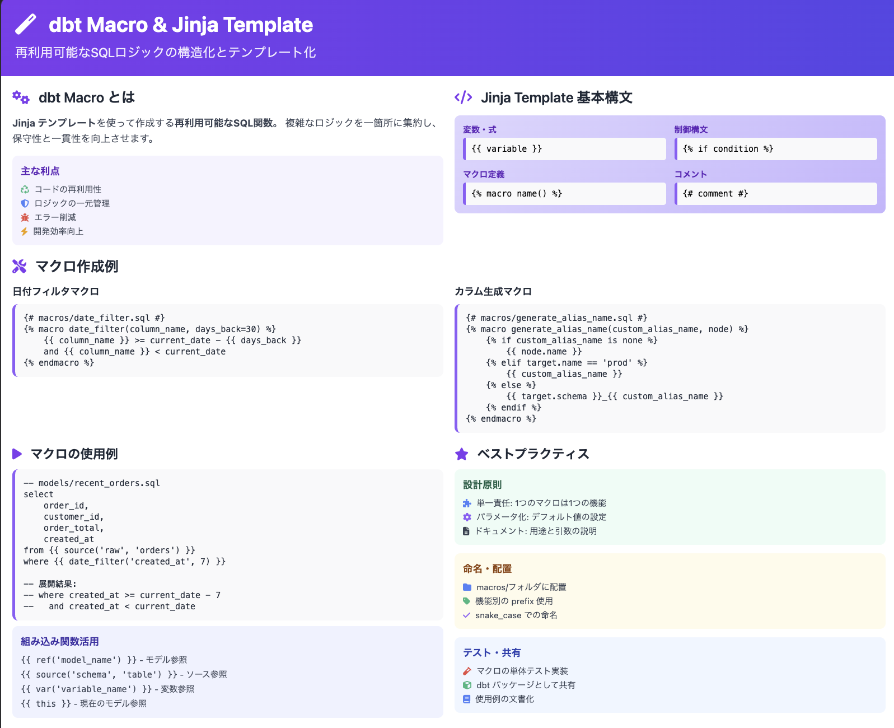
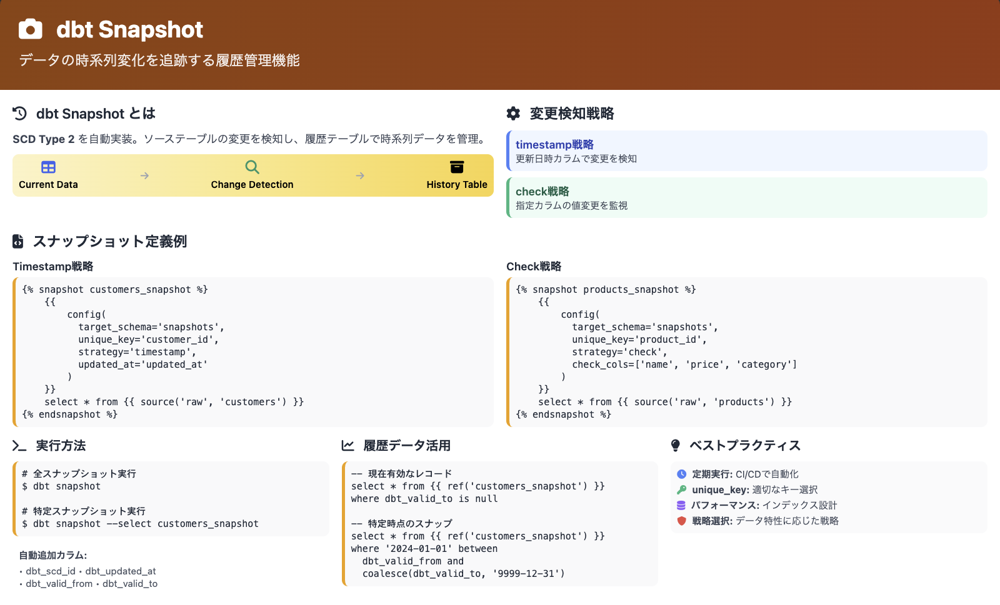

# 第 3 章: 更に進んだ dbt 活用 – マクロとスナップショット

## 講義 1: Jinja テンプレートとマクロ入門

### Jinja テンプレートの基礎

dbt は Jinja テンプレートエンジンを使用して、SQL を動的に生成します。Jinja の主な構文は以下の通りです：

- **変数の埋め込み**: `{{ variable }}`
- **制御構文**: ` ... `
- **コメント**: `{# This is a comment #}`

基本的な使用例：

```sql
-- 環境に応じてフィルタリング条件を変更
select * from {{ ref('stg_orders') }}

where ordered_at >= dateadd('day', -30, current_date)

```



### Jinja の制御構文

**条件分岐（if-else）**:

```sql

    select * from {{ ref('stg_orders') }} limit 100

    select * from {{ ref('stg_orders') }} limit 1000

    select * from {{ ref('stg_orders') }}

```

**ループ（for）**:

```sql
select
    store_id,
    
    count(distinct case when p.type = '{{ product_type }}' then i.sku end) as {{ product_type }}_product_count
    ,
    
from {{ ref('stg_orders') }} o
join {{ ref('stg_items') }} i on o.order_id = i.order_id
join {{ ref('stg_products') }} p on i.product_sku = p.product_sku
group by store_id
```

### マクロの基本

マクロは、再利用可能なコードブロックを定義する機能です。関数のように引数を受け取り、SQL コードを生成します。

マクロの定義例（`macros/get_product_types.sql`）：

```sql

    
    {{ return(product_types) }}

```

このマクロを使用するモデルを作成します。`models/marts/core/product_count_by_store.sql`を作成：

```sql
{{
    config(
        materialized='table'
    )
}}

select
    store_id,
    
    count(distinct case when p.type = '{{ product_type }}' then i.sku end) as {{ product_type }}_product_count
    ,
    
from {{ ref('stg_orders') }} o
join {{ ref('stg_items') }} i on o.order_id = i.order_id
join {{ ref('stg_products') }} p on i.product_sku = p.product_sku
group by store_id
```

#### dbt compile で生成される SQL の確認

```bash
# プロジェクトディレクトリに移動
cd jaffle_shop

# dbt compileを実行
dbt compile --select product_count_by_store --profiles-dir .

# 生成されたSQLを確認
cat target/compiled/jaffle_shop/models/marts/core/product_count_by_store.sql
```

生成結果：

```sql
select
    store_id,
    count(distinct case when p.type = 'jaffle' then i.sku end) as jaffle_product_count
    ,
    count(distinct case when p.type = 'beverage' then i.sku end) as beverage_product_count

from "dev"."main"."stg_orders" o
join "dev"."main"."stg_items" i on o.order_id = i.order_id
join "dev"."main"."stg_products" p on i.product_sku = p.product_sku
group by store_id
```

マクロが展開(`p.type = 'jaffle'`, `p.type = 'beverage'`)されて、ループが実際の SQL 文に変換されていることが確認できます。

### 引数を持つマクロの作成

`macros/limit_data_in_dev.sql`を作成：

```sql

    
        where {{ column_name }} >= dateadd('day', -{{ days }}, current_date)
    

```

このマクロを使用するモデルを作成します。`models/marts/core/fact_orders_with_macro.sql`を作成：

```bash
cat > models/marts/core/fact_orders_with_macro.sql << 'EOF'
{{
    config(
        materialized='table'
    )
}}

select
    order_id,
    customer_id,
    ordered_at,
    store_id,
    order_total_dollars
from {{ ref('fact_orders') }}
{{ limit_data_in_dev('ordered_at', 7) }}
EOF
```

#### dbt compile で生成される SQL の確認

dbt compile コマンドを実行して、マクロがどのように SQL に展開されるか確認しましょう：

```bash
# dbt compileを実行
cd jaffle_shop
dbt compile --select fact_orders_with_macro --profiles-dir .
```

生成された SQL は`target/compiled/jaffle_shop/models/marts/core/fact_orders_with_macro.sql`に保存されます：

```bash
# 生成されたSQLを確認
cat target/compiled/jaffle_shop/models/marts/core/fact_orders_with_macro.sql
```

dev 環境での生成結果：

```sql
select
    order_id,
    customer_id,
    ordered_at,
    store_id,
    order_total_dollars
from "dev"."main"."fact_orders"


        where ordered_at >= dateadd('day', -7, current_date)
```

prod 環境をシミュレートする場合：

```bash
# prod環境でcompile
dbt compile --select fact_orders_with_macro --target prod --profiles-dir .
```

prod 環境での生成結果（where 句が含まれない）：

```sql
select
    order_id,
    customer_id,
    ordered_at,
    store_id,
    order_total_dollars
from "prod"."main"."fact_orders"
```

### 実用的なマクロの例

顧客ごとの累計売上を計算するマクロ（`macros/calculate_customer_lifetime_value.sql`）：

```sql

    sum({{ amount_column }}) over (
        partition by {{ customer_id_column }}
        order by {{ date_column }}
        rows unbounded preceding
    ) as customer_lifetime_value

```

このマクロを使用するモデルを作成します。`models/marts/core/customer_orders_with_ltv.sql`を作成：

```sql
{{
    config(
        materialized='view'
    )
}}

select
    order_id,
    customer_id,
    ordered_at,
    order_total_dollars,
    {{ calculate_customer_lifetime_value('customer_id', 'order_total_dollars', 'ordered_at') }}
from {{ ref('fact_orders') }}
order by customer_id, ordered_at
```

#### dbt compile で生成される SQL の確認

```bash
# dbt compileを実行
dbt compile --select customer_orders_with_ltv --profiles-dir .

# 生成されたSQLを確認
cat target/compiled/jaffle_shop/models/marts/core/customer_orders_with_ltv.sql
```

生成結果：

```sql
select
    order_id,
    customer_id,
    ordered_at,
    order_total_dollars,

    sum(order_total_dollars) over (
        partition by customer_id
        order by ordered_at
        rows unbounded preceding
    ) as customer_lifetime_value

from "dev"."main"."fact_orders"
order by customer_id, ordered_at
```

### 複雑なマクロの例：動的なピボットテーブル

より高度な例として、動的にピボットテーブルを生成するマクロを作成します。

`macros/pivot.sql`を作成：

```sql

    
        {{ agg_func }}(
            case when {{ column_name }} = '{{ value }}'
            then {{ agg_column }}
            end
        ) as {{ column_name }}_{{ value }}
        ,
    

```

このマクロを使用して店舗別の商品タイプ別売上を集計するモデルを作成します。`models/marts/core/store_product_sales.sql`：

```sql
{{
    config(
        materialized='table'
    )
}}

with order_items as (
    select
        o.store_id,
        p.type as product_type,
        i.item_total_dollars
    from {{ ref('stg_orders') }} o
    join {{ ref('stg_items') }} i on o.order_id = i.order_id
    join {{ ref('stg_products') }} p on i.product_sku = p.product_sku
)

select
    store_id,
    {{ pivot('product_type', ['jaffle', 'beverage'], 'sum', 'item_total_dollars') }},
    sum(item_total_dollars) as total_sales
from order_items
group by store_id
```

#### dbt compile で生成される SQL の確認

```bash
# dbt compileを実行
dbt compile --select store_product_sales

# 生成されたSQLを確認
cat target/compiled/jaffle_shop/models/marts/core/store_product_sales.sql
```

生成結果：

```sql
with order_items as (
    select
        o.store_id,
        p.type as product_type,
        i.item_total_dollars
    from "dev"."main"."stg_orders" o
    join "dev"."main"."stg_items" i on o.order_id = i.order_id
    join "dev"."main"."stg_products" p on i.product_sku = p.product_sku
)

select
    store_id,


        sum(
            case when product_type = 'jaffle'
            then item_total_dollars
            end
        ) as product_type_jaffle,

        sum(
            case when product_type = 'beverage'
            then item_total_dollars
            end
        ) as product_type_beverage

,
    sum(item_total_dollars) as total_sales
from order_items
group by store_id
```

### dbt Utils パッケージの活用

dbt Utils は、便利なマクロを集めたパッケージです。

`packages.yml`を作成してパッケージをインストール：

```bash
cat > packages.yml << 'EOF'
packages:
  - package: dbt-labs/dbt_utils
    version: 1.3.0
EOF
```

パッケージのインストール：

```bash
dbt deps
```

dbt Utils マクロの使用例：

```sql
-- 複数のカラムに基づく一意性テスト
{{ dbt_utils.test_unique_combination_of_columns(
    model=ref('stg_orders'),
    combination_of_columns=['customer_id', 'ordered_at']
) }}

-- 日付の差分を計算（店舗開店からの経過日数）
select
    o.order_id,
    o.store_id,
    {{ dbt_utils.datediff('s.opened_at', 'o.ordered_at', 'day') }} as days_since_store_opened
from {{ ref('stg_orders') }} o
join {{ ref('stg_stores') }} s on o.store_id = s.store_id
```

### カスタムテストのマクロ化

前章で作成したカスタムテスト`assert_order_has_items`をマクロ化して、より汎用的に使えるようにします。

`macros/tests/test_has_related_records.sql`を作成：

```bash
cat > macros/tests/test_has_related_records.sql << 'EOF'


-- 関連レコードが存在することを確認する汎用マクロ
-- 例：すべての注文に少なくとも1つのアイテムが存在することを確認

with main_records as (
    select
        {{ column_name }} as id
    from {{ model }}
),

related_records as (
    select
        {{ related_column }} as id,
        count(*) as record_count
    from {{ related_model }}
    group by {{ related_column }}
),

-- 関連レコードが存在しないメインレコードを検出
records_without_relations as (
    select
        m.id
    from main_records m
    left join related_records r on m.id = r.id
    where r.id is null
)

select * from records_without_relations


EOF
```

マクロ化したテストの使用例（`models/schema.yml`）：

```yaml
version: 2

models:
  - name: stg_orders
    tests:
      # マクロ化したテストを使用
      - has_related_records:
          column_name: order_id
          related_model: ref('stg_items')
          related_column: order_id
```

これにより、同じパターンのテストを他のモデルでも簡単に再利用できます：

```yaml
- name: stg_products
  tests:
    # 製品に関連するサプライが存在することを確認
    - has_related_records:
        column_name: product_sku
        related_model: ref('stg_supplies')
        related_column: product_sku
```

#### カスタムテストマクロの compile 結果を確認

テストも dbt compile で展開される SQL を確認できます：

```bash
# または特定のテストのみ
dbt test --select stg_orders --profiles-dir .
```

コンパイル結果:

```sql
with main_records as (
    select
        order_id as id
    from "dev"."main"."stg_orders"
),

related_records as (
    select
        order_id as id,
        count(*) as record_count
    from "dev"."main"."stg_items"
    group by order_id
),

-- 関連レコードが存在しないメインレコードを検出
records_without_relations as (
    select
        m.id
    from main_records m
    left join related_records r on m.id = r.id
    where r.id is null
)

select * from records_without_relations
```

### マクロのデバッグとベストプラクティス

#### 1. マクロのデバッグ方法

Jinja の`{{ log() }}`関数を使用してデバッグ情報を出力できます `macros/debug_macro_example.sql`を作成：

```bash
cat > macros/debug_macro_example.sql << 'EOF'

    {{ log("Processing table: " ~ table_name, info=True) }}

    
        select count(*) as cnt from {{ table_name }}
    

    
    
        
        {{ log("Row count: " ~ row_count, info=True) }}
    

    select * from {{ table_name }}

EOF
```

#### 2. マクロの実行例と compile 結果

デバッグ機能を持つマクロを使用するモデル `models/marts/core/debug_example.sql`：

```bash
cat > models/marts/core/debug_example.sql << 'EOF'
{{ debug_macro_example(ref('stg_customers')) }}
EOF
```

実行とログの確認：

```bash
# compileを実行（ログが出力される）
dbt compile --select debug_example
```

期待されるログ出力：

```
13:27:54  Processing table: "dev"."main"."stg_customers"
13:27:55  Row count: 930
```

#### 3. 条件分岐を含む高度なマクロ

データベースタイプに応じて異なる SQL を生成するマクロの例：

```sql

    
        {{ from_date }} + interval '{{ interval }} {{ datepart }}'
    
        dateadd({{ datepart }}, {{ interval }}, {{ from_date }})
    
        date_add({{ from_date }}, interval {{ interval }} {{ datepart }})
    
        {{ from_date }} + interval '{{ interval }} {{ datepart }}'
    

```

使用例と compile 結果：

```sql
-- モデルでの使用
select
    order_id,
    ordered_at,
    {{ dateadd_custom('day', 7, 'ordered_at') }} as week_later
from {{ ref('stg_orders') }}

-- DuckDBでのcompile結果
select
    order_id,
    ordered_at,
    ordered_at + interval '7 day' as week_later
from jaffle_shop.stg_orders
```

---

## 講義 2: スナップショットで履歴データを管理する

### スナップショットの概念

スナップショットは、時間の経過とともに変化するデータの履歴を保持するための機能です。特に以下のような場合に有用です：

- ディメンションテーブルの変更履歴管理（SCD: Slowly Changing Dimensions）
- 監査目的でのデータ変更追跡
- 時点データの再現

スナップショットテーブルには、通常のカラムに加えて以下の特別なカラムが追加されます：

- `dbt_scd_id`: レコードの一意識別子
- `dbt_updated_at`: レコードが最後に更新された時刻
- `dbt_valid_from`: レコードが有効になった時刻
- `dbt_valid_to`: レコードが無効になった時刻（現在有効なレコードは NULL）



### スナップショットの作成

`snapshots/customers_snapshot.sql`を作成：

```bash
cat > snapshots/customers_snapshot.sql << 'EOF'


{{
    config(
      target_schema='snapshots',
      unique_key='id',
      strategy='check',
      check_cols=['name'],
    )
}}

select
    *
from {{ source('jaffle_shop_raw', 'customers') }}


EOF
```

### スナップショット戦略

dbt では 2 つのスナップショット戦略があります：

1. **timestamp 戦略**: `updated_at`のようなタイムスタンプカラムを使用して変更を検出
2. **check 戦略**: 指定したカラムの値が変更されたかどうかをチェック

check 戦略の例：

```sql


{{
    config(
      target_schema='snapshots',
      unique_key='id',
      strategy='check',
      check_cols=['subtotal', 'tax_paid', 'order_total'],
    )
}}

select * from {{ source('jaffle_shop_raw', 'orders') }}


```

### スナップショットの実行

```bash
# すべてのスナップショットを実行
dbt snapshot

# 特定のスナップショットのみ実行
dbt snapshot --select customers_snapshot
```

期待される出力例：

```
Running with dbt=1.5.0
Found 2 snapshots, 0 tests, 0 analyses, 0 macros, 0 operations, 0 seed files, 0 sources, 0 exposures, 0 metrics, 0 groups

16:45:30 | Concurrency: 1 threads (target='dev')
16:45:30 |
16:45:30 | 1 of 2 START snapshot jaffle_shop.customers_snapshot ................ [RUN]
16:45:30 | 1 of 2 OK snapshotted jaffle_shop.customers_snapshot ................ [OK in 0.10s]
16:45:30 | 2 of 2 START snapshot jaffle_shop.orders_snapshot ................... [RUN]
16:45:30 | 2 of 2 OK snapshotted jaffle_shop.orders_snapshot ................... [OK in 0.09s]
16:45:30 |
16:45:30 | Finished running 2 snapshots in 0.20s.

Completed successfully

Done. PASS=2 WARN=0 ERROR=0 SKIP=0 TOTAL=2
```

### スナップショットの確認

DuckDB でスナップショットテーブルの内容を確認：

```bash
duckdb dev.duckdb -c "SELECT * FROM snapshots.customers_snapshot ORDER BY id, dbt_valid_from;"
```

### データ変更後のスナップショット

顧客データを変更してスナップショットを再実行します。

1. DuckDB でデータを直接変更：

```bash

-- DuckDBを起動
duckdb dev.duckdb -c "UPDATE jaffle_shop_raw.customers SET name = 'Scott Thompson Jr.' WHERE id = '33a51363-1989-4967-93a1-b8e225b91e84';"
```

2. スナップショットを再実行：

```bash
dbt snapshot
```

3. 変更後のスナップショットテーブルを確認：

```bash
duckdb dev.duckdb -c "SELECT * FROM snapshots.customers_snapshot WHERE id = '33a51363-1989-4967-93a1-b8e225b91e84' ORDER BY dbt_valid_from;"
```

### スナップショットの活用例

特定時点のデータを再現するクエリ：

```sql
-- 2023-05-01時点の顧客データを取得
select
    id,
    name
from {{ ref('customers_snapshot') }}
where dbt_valid_from <= '2023-05-01'
and (dbt_valid_to > '2023-05-01' or dbt_valid_to is null)
```

変更履歴を追跡するクエリ：

```sql
-- 顧客データの変更履歴を取得
select
    id,
    name,
    dbt_valid_from as valid_from,
    coalesce(dbt_valid_to, current_timestamp) as valid_to
from {{ ref('customers_snapshot') }}
order by id, dbt_valid_from
```

---

## 講義 3: まとめと次のステップ

### 本講座の総括

この講座では、dbt（Data Build Tool）を使用したモダンデータスタックにおけるデータ変換処理について学びました：

1. **dbt の基礎と開発環境セットアップ**

   - dbt とモダンデータスタックの概要
   - 開発環境の準備（MacOS, Python, dbt Core）
   - dbt プロジェクトの初期化とデータ準備
   - 最初のモデル作成と実行

2. **モデル開発の実践と品質管理**

   - モデルの拡張とデータ変換ロジック
   - データテストによる品質保証
   - ドキュメンテーションとデータリネージの活用
   - インクリメンタルモデルとソース定義

3. **更に進んだ dbt 活用**
   - Jinja テンプレートとマクロ
   - スナップショットによる履歴データ管理

これらの機能を組み合わせることで、データ変換パイプラインを効率的に構築・管理できるようになりました。

### dbt のベストプラクティス

1. **モデル構造の標準化**

   - staging → intermediate → marts の階層構造
   - 命名規則の統一（stg*\*, int*\_, fct\_\_, dim\_\*）

2. **テストの徹底**

   - 主要なカラムには必ず一意性・非 NULL 制約を設定
   - 外部キー関係を明示的にテスト
   - ビジネスルールをカスタムテストで検証

3. **ドキュメントの充実**

   - モデルとカラムに詳細な説明を追加
   - README ファイルでモデルグループを説明
   - 使用例を含める

4. **バージョン管理の活用**
   - Git でコードを管理
   - プルリクエストでコードレビュー
   - CI/CD パイプラインでテスト自動化

### 次のステップ

1. **dbt Cloud の活用**

   - スケジュール実行
   - Web IDE
   - CI/CD 統合
   - ホスティングされたドキュメント

2. **高度な dbt 機能**

   - マルチ環境運用（dev/qa/prod）
   - カスタムマテリアライゼーション
   - パッケージ開発
   - メタデータ API

3. **クラウドデータウェアハウスとの連携**

   - Snowflake
   - BigQuery
   - Redshift
   - Databricks

### 学習リソース

1. **公式ドキュメント**

   - [dbt Developer Hub](https://docs.getdbt.com/)
   - [dbt Learn](https://learn.getdbt.com/)

2. **コミュニティ**

   - [dbt Slack](https://www.getdbt.com/community/join-the-community/)
   - [dbt Discourse](https://discourse.getdbt.com/)

3. **ブログとチュートリアル**

   - [dbt Blog](https://blog.getdbt.com/)
   - [dbt Labs YouTube](https://www.youtube.com/c/dbtLabs)

4. **日本語リソース**
   - [Zenn dbt 記事](https://zenn.dev/topics/dbt)

### まとめ

dbt は、データアナリストやエンジニアがデータ変換処理を効率的に管理するための強力なツールです。SQL の知識を活かしながら、ソフトウェア開発のベストプラクティスをデータ分析に取り入れることができます。

本講座で学んだ知識を基に、実際のプロジェクトで dbt を活用し、データの信頼性と再現性を高めていきましょう。モダンデータスタックの中心的なツールとしての dbt の価値を理解し、データエンジニアリングの最新トレンドを取り入れた実践的なスキルを身につけることができました。

今後も継続的に学習を進め、より複雑なデータパイプラインの構築や、チーム全体での dbt 活用に挑戦してみてください。
